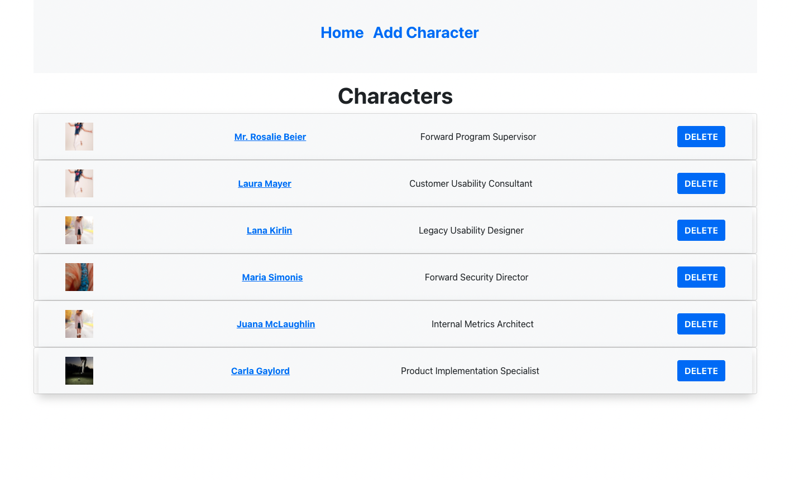

# Not Simpsons

This is a test project which makes an API call and serve the result change the selections via Local Storage and use it as backend.

<br>

## Built With

- Javascript
- React
- Redux
- Npm
- Bootstrap

## Prerequisities

To get this project up and running locally, you must have node installed on your local machine.

## Getting Started

**Setup**

- Clone this repository.
- Navigate into the project directory via the terminal<br>
- Next run ```npm install``` to install the necessary dependencies<br>
- Run ```npm run start``` to make the bundle.<br>
- The command above will run the local server.<br>
- Wait for bundle to finish.<br>
- Enjoy!<br>

**Repository Content**

- src folder has Actions which controls the Redux action types.
- Same folder has Components that are presentational, using the global state with the help of Redux.
- helpers are the components that have business logic inside them. They are the services.
- Reducers folder contains the Redux reducers, and return our result objects.
- Inside store folder store is connected and thunk middleware applied for async operations.
- The route handler is the AppContainer file.
- To run tests ```npm run test``` command should be run.

## Authors

👤 **Eyüp Sercan UYGUR**

-   Github: [@eypsrcnuygr](https://github.com/eypsrcnuygr)
-   Twitter: [@eypsrcnuygr](https://twitter.com/eypsrcnuygr)
-   LinkedIn: [eypsrcnuygr](https://www.linkedin.com/in/eypsrcnuygr/)
-   Email: [Eyüp Sercan UYGUR](sercanuygur@gmail.com)


## 🤝 Contributing

Contributions, issues and feature requests are welcome!

## Show your support

Give a ⭐️ if you like this project!

## Acknowledgments

- This Project was part of an application prcedure for [Eteration](https://www.eteration.com/tr).

## 📝 License

This project is [MIT](https://github.com/git/git-scm.com/blob/master/MIT-LICENSE.txt) licensed.
